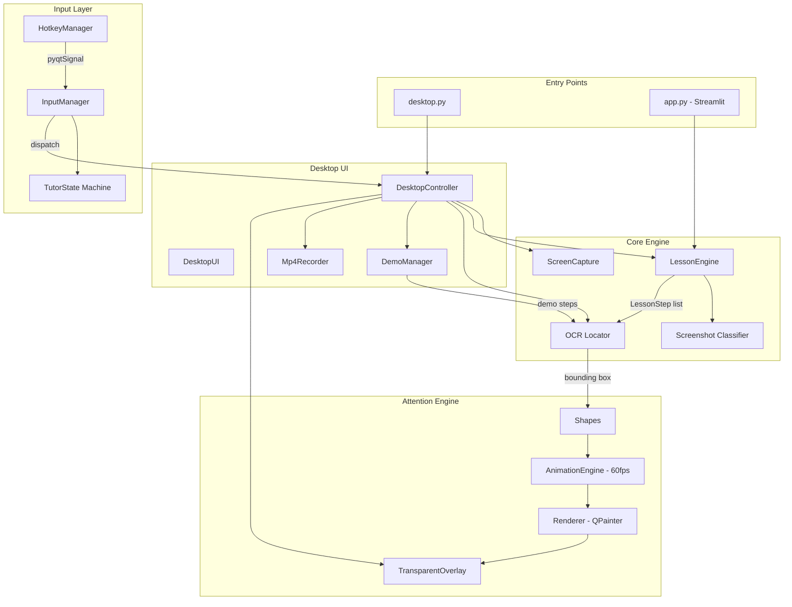

# ClickTutor AI — Full Project Handover Document

> **Purpose:** This document is a complete handover for any developer (or AI agent) taking over this project. It covers everything from product vision to individual file responsibilities to uncommitted WIP changes.

---

## 1. The Idea, Vision & Final Goal

### The Problem
When a student is looking at code, a math problem, a diagram, or documentation on their screen and doesn't understand something, their options are:
1. Copy-paste into ChatGPT and read a wall of text (loses visual context)
2. Watch a YouTube tutorial that covers the general concept but not *their specific screen*
3. Ask a friend to literally point at their screen and explain

ClickTutor is **option 3, but with AI.**

### The Vision
An AI tutor that **lives on your desktop**. You press a hotkey, it captures what you're looking at, you ask a question, and it **points directly at what matters on your screen** — highlighting elements step-by-step with animated circles, rectangles, and underlines while explaining each concept.

It doesn't just tell you the answer. It **guides your attention** — the same way a human tutor would lean over, point at a line of code, and say "see this? Here's why it matters."

### Inspiration
The concept is inspired by **Clicky** (by Farza) — a viral macOS AI companion that sits next to your cursor. The open-source Swift reference implementation lives in `clicky_repo/` in this project. ClickTutor takes the same core idea but:
- Runs cross-platform (Windows/Linux, not macOS-only)
- Built in Python + PyQt6 (not Swift/SwiftUI)
- Focuses on **teaching/tutoring** rather than general assistance
- Uses **OCR-based attention guidance** (with an architecture ready for AI-based localization in Phase 4)

### The Core Loop
```
Press Hotkey → Capture Screen → Ask a Question → AI Generates a Lesson →
OCR Locates Anchors on Screen → Attention Engine Highlights Them →
Floating Companion Shows Explanation → User Navigates Steps → Done
```

### Final Goal (End of Phase 3 = v1.0)
At the end of Phase 3, a recruiter should be able to watch a **30–45 second demo** and immediately understand the product:

> *Press a hotkey → ClickTutor captures the screen → you ask a question → it highlights exactly what matters → explains it step by step through a floating companion.*

That is the version meant for **portfolio, GitHub, and LinkedIn launch.**

### Concrete Success Scenario
```
Open VS Code with some code on screen
    → Press Ctrl+Shift+A
    → Screen captured in memory
    → Question popup appears
    → Ask: "What does count++ do?"
    → Floating companion switches to THINKING
    → Lesson generated by Gemini
    → Yellow circle highlights "count++"
    → Explanation appears in companion
    → Click Next → circle moves to next element
    → Explanation updates
    → Lesson completes
    → Return to IDLE
```

No manual screenshots. No developer controls visible. No crashes. Graceful recovery from failures.

### What ClickTutor Is NOT (Yet)
- It is NOT a chat assistant or general AI companion
- It is NOT a code editor plugin
- It does NOT follow your cursor or react in real-time (Phase 4+)
- It does NOT have voice I/O yet (Phase 3 Milestone 10, optional)
- It does NOT have a backend/cloud component (purely local)

### Tech Stack
- **AI Backend:** Google Gemini (`gemini-3.1-flash-lite`)
- **OCR Backend:** Tesseract (via pytesseract)
- **Desktop Overlay:** PyQt6 transparent window with custom 60fps animation engine
- **Screen Capture:** `mss` library (with PowerShell fallback for WSL development)
- **Two interfaces exist:**
  1. **Desktop Overlay** (primary, via PyQt6) — `python desktop.py`
  2. **Streamlit Web App** (secondary, legacy) — `streamlit run app.py`

---

## 2. Development History

The project has **47 commits** across 3 phases. Here's the chronological evolution:

### Phase 1 — Proof of Concept (Streamlit Web App)
Built the core AI tutoring pipeline as a web application:
- Gemini Vision proof of concept
- Streamlit chat interface with conversation memory
- Region-aware screenshot cropping
- Tutor modes (student, DSA, exam)
- OCR-based text localization with Tesseract
- PIL-based image highlighting
- Session-based image handling
- Screenshot type classifier (heuristic + Gemini fallback)
- Concept-based tutoring prompts (not just "what is this line" — teaches *why*)
- Structured lesson steps with ANCHOR/CONTEXT/ATTENTION/EMPHASIS/EXPLANATION
- Interactive step-by-step navigation in Streamlit UI

### Phase 2 — Desktop Overlay & Attention Engine
Transformed from web app to desktop application:
- Transparent PyQt6 overlay rendered on top of all windows
- Custom attention shapes (Rectangle, Circle, Underline, Label, DebugBox)
- 60 FPS animation engine with fade-in and pulse breathing effects
- OCR coordinate calibration and debug overlay
- Desktop controller and lightweight control panel UI
- Lesson engine connected to overlay renderer
- DemoManager for playing pre-built offline lessons
- CaptureEngine using `mss` (with WSL PowerShell fallback)
- Presentation Mode checkbox for recording polished demos
- Mp4Recorder for recording demo walkthroughs to video

### Phase 2.5 — Codebase Refactor & Cleanup
Major cleanup before Phase 3:
- Reorganized project structure (`demo/`, `runtime/`, `assets/`, `tests/`, `tools/`, `archive/`)
- Self-contained demo packages (`demo/rotate_image/`, `demo/kth_missing/`)
- Stripped all 22 debug `print()` statements, replaced with `logging`
- Separated `requirements.txt` from `requirements-dev.txt`
- Expanded `.gitignore`
- Updated README for dual desktop/streamlit modes

### Phase 3 — Desktop Companion (IN PROGRESS)
Transforming into a seamless desktop companion. **Completed so far:**
- **Milestone 1:** InputManager + TutorState machine (COMMITTED)
- **Milestones 2-4.5:** Global hotkeys, live screen capture, end-to-end workflow, graceful failure handling (UNCOMMITTED — see Section 12)

---

## 3. Project Structure

```
ClickTutor_AI/
│
├── app.py                        # Streamlit web app entry point
├── desktop.py                    # Desktop overlay entry point
├── requirements.txt              # Runtime dependencies
├── requirements-dev.txt          # Dev-only dependencies (matplotlib, etc.)
├── readme.md                     # Project README
├── .env                          # GEMINI_API_KEY (gitignored)
├── .gitignore
│
├── src/                          # ═══ APPLICATION SOURCE CODE ═══
│   │
│   ├── tutor.py                  # Gemini model initialization & explain_image()
│   ├── lesson_engine.py          # Core: prompt building, step parsing, lesson generation
│   ├── ocr_locator.py            # Core: OCR extraction + 6-pass text locator
│   ├── highlighter.py            # PIL-based image annotation (draw boxes on images)
│   ├── screenshot_classifier.py  # Classifies screenshots (code/math/diagram/etc.)
│   ├── lesson_validator.py       # Validates lesson step structure
│   ├── chat_tutor.py             # TutorSession wrapper for Streamlit
│   │
│   ├── attention/                # ═══ ATTENTION/OVERLAY ENGINE ═══
│   │   ├── shapes.py             # Shape dataclasses (Rectangle, Circle, Underline, Label, Debug)
│   │   ├── animation.py          # 60 FPS AnimationEngine (fade-in, pulse glow)
│   │   ├── renderer.py           # QPainter-based shape rendering
│   │   └── overlay.py            # TransparentOverlay QWidget (fullscreen transparent window)
│   │
│   ├── input/                    # ═══ INPUT MANAGEMENT (Phase 3) ═══
│   │   ├── __init__.py           # Exports: InputManager, TutorState, InputAction, HotkeyManager
│   │   ├── state_machine.py      # TutorState enum (IDLE → CAPTURING → ANALYZING → TEACHING → FINISHED)
│   │   ├── events.py             # InputAction enum (CAPTURE_SCREEN, TOGGLE_DEBUG, CANCEL_LESSON)
│   │   ├── input_manager.py      # Routes actions based on state, dispatches to listeners
│   │   └── hotkeys.py            # Global hotkey listener using `keyboard` library + pyqtSignal
│   │
│   ├── capture/                  # ═══ SCREEN CAPTURE (Phase 3, UNCOMMITTED) ═══
│   │   ├── __init__.py           # Exports: ScreenCapture
│   │   └── screen_capture.py     # In-memory capture via mss, WSL powershell fallback
│   │
│   └── desktop/                  # ═══ DESKTOP APPLICATION ═══
│       ├── controller.py         # DesktopController + DesktopUI (main orchestrator)
│       ├── capture.py            # Old CaptureEngine (being replaced by src/capture/)
│       ├── capture.ps1           # PowerShell script for WSL screen capture fallback
│       ├── demo_manager.py       # DemoManager: plays pre-built demo lessons
│       ├── recorder.py           # Mp4Recorder: records demos to video
│       └── demos/                # Legacy demo storage (being replaced by demo/)
│
├── demo/                         # ═══ SELF-CONTAINED DEMO PACKAGES ═══
│   ├── rotate_image/
│   │   ├── lesson.json           # Pre-built lesson data + metadata
│   │   └── screenshot.png        # Static screenshot for demo playback
│   └── kth_missing/
│       ├── lesson.json
│       └── screenshot.png
│
├── tests/                        # ═══ TEST SCRIPTS ═══
│   ├── run_tests.py              # Recursive test suite runner
│   ├── test_demo_anchors.py      # Validates demo anchor accuracy
│   ├── test_ocr.py, test_highlighter.py, test_chat.py, test_tutor.py
│   ├── test_capture_engine.py, test_mss.py, test_mss2.py
│   ├── test_pyqt_capture.py, test_recorder.py
│   ├── test_coordinate_mapping.py
│   └── code/, math/, diagram/, dashboard/, pdf/, slides/, websites/  # Test images by category
│
├── tools/                        # Developer utilities
│   └── benchmark.py              # OCR + lesson latency benchmark tool
│
├── benchmarks/                   # Benchmark results and charts
├── assets/                       # Static assets (test images)
├── runtime/                      # Runtime-generated files (gitignored)
│   ├── captures/, highlights/, recordings/, temp/, logs/
├── archive/                      # Archived experimental scripts
├── scripts/                      # Automation scripts
├── docs/                         # Documentation
└── clicky_repo/                  # Reference: open-source Swift "Clicky" app (read-only)
```

---

## 4. Key Modules — Detailed Explanation

### 4.1 `src/tutor.py` — Gemini Model Configuration
- Loads `GEMINI_API_KEY` from `.env`
- Initializes `google.generativeai` with model `gemini-3.1-flash-lite`
- Exports a global `model` object used by `lesson_engine.py` and `screenshot_classifier.py`
- Contains `explain_image()` — a simple vision prompt used by the Streamlit flow

### 4.2 `src/lesson_engine.py` — The Brain
This is the most important file. It:

1. **Builds a structured prompt** that tells Gemini to return lessons in a specific format:
   ```
   STEP 1
   TITLE: ...
   ANCHOR: ...      ← exact text visible on screen for OCR to locate
   CONTEXT: ...     ← surrounding text to disambiguate duplicate anchors
   ATTENTION: ...   ← circle | rectangle | underline | none
   EMPHASIS: ...    ← high | medium | low
   EXPLANATION: ... ← the actual teaching content
   ```

2. **Parses the response** with regex (`STEP_PATTERN`) to extract structured steps.

3. **Generates highlight images** (for Streamlit mode) by calling `find_text()` + `highlight_box()`.

4. **Adapts prompts by content type** — if the classifier says "code", the prompt adds code-specific guidelines ("explain execution flow, common bugs"). Same for math, diagrams, dashboards, etc.

> **Critical:** The `LessonEngine` constructor now accepts `image_or_path` (either a `str` file path or a `PIL.Image`). This was changed in the uncommitted Phase 3 work to support in-memory capture.

### 4.3 `src/ocr_locator.py` — The 6-Pass Text Locator
Given OCR data and a target text string, this module finds where that text appears on screen. It uses a **6-pass matching strategy** (in priority order):

| Pass | Name | Strategy |
|------|------|----------|
| 0 | Line-Based Substring | Concatenates all words on each OCR line, checks if normalized target is a substring. Handles symbols/brackets. |
| 1 | Exact Phrase | Matches multi-word sequences word-by-word exactly. |
| 2 | Exact Word | Matches any single target word exactly. |
| 3 | Fuzzy Phrase | Multi-word fuzzy match using `SequenceMatcher` (threshold 0.82). |
| 4 | Fuzzy Word | Single-word fuzzy match (threshold 0.82). |
| 5 | Partial Match | Substring containment check (min 4 chars). |

**Context resolution:** When multiple candidates are found, it scores each by `SequenceMatcher` similarity between the OCR line text and the `CONTEXT` field from the lesson step. This resolves ambiguous anchors like "count" appearing in both `int count = 0` and `count++`.

**Scaling:** OCR is run on a 3x upscaled grayscale image for accuracy. All bounding boxes are scaled back down before rendering.

> **Critical change (uncommitted):** `extract_ocr_data()` now accepts `image_or_path` (str or PIL.Image) instead of only a file path.

### 4.4 `src/attention/` — The Attention Engine

**`shapes.py`**: Dataclasses defining visual shapes:
- `AttentionShape` (base): x, y, width, height, opacity, scale, glow_strength, animation_types
- `RectangleShape`: Red outline, 6px padding
- `CircleShape`: Blue outline, 10px padding
- `UnderlineShape`: Green line, 2px padding
- `LabelShape`: Text label with background color (fade only, no pulse)
- `DebugBoxShape`: OCR debug visualization (no animation)

**`animation.py`**: Drives the visual animation at ~60 FPS:
- Phase 1: **Fade-in** (300ms, ease-out-cubic)
- Phase 2: **Pause** (200ms)
- Phase 3: **Pulse breathing** (2.5 cycles × 800ms = 2000ms, cosine wave)
- Auto-stops the timer when animation completes

**`renderer.py`**: QPainter rendering of each shape type. Handles:
- Anti-aliased drawing
- Glow effects (semi-transparent wider strokes behind the main stroke)
- Opacity-aware rendering
- Per-shape-type rendering logic

**`overlay.py`**: The fullscreen transparent `QWidget`:
- `WindowStaysOnTopHint | WindowTransparentForInput | FramelessWindowHint`
- `WA_TranslucentBackground`
- `set_shapes(shapes)` → starts animation sequence
- `set_background(image_or_path, show)` → shows a background image (for debug/demo mode)
- `clear()` → stops all animation and removes shapes

> **Critical change (uncommitted):** `set_background()` now accepts PIL Images in addition to file paths, using `PIL.ImageQt.ImageQt` for conversion.

### 4.5 `src/input/` — Input Management (Phase 3)

**`state_machine.py`**: `TutorState` enum — `IDLE → CAPTURING → ANALYZING → TEACHING → FINISHED`

**`events.py`**: `InputAction` enum — `CAPTURE_SCREEN`, `TOGGLE_DEBUG`, `CANCEL_LESSON`

**`input_manager.py`**: The central routing hub:
- Maintains `current_state: TutorState`
- `handle_action(action)` — checks state before dispatching (e.g., ignores CAPTURE_SCREEN if not IDLE)
- Listener pattern: `add_listener(callback)` → `_dispatch(action)` calls all listeners
- Logs every state transition and action

**`hotkeys.py`**: Global keyboard shortcuts using the `keyboard` library:
- `Ctrl+Shift+A` → `CAPTURE_SCREEN`
- `Ctrl+Shift+D` → `TOGGLE_DEBUG`
- `Esc` → `CANCEL_LESSON`
- Uses `pyqtSignal` to safely cross from the keyboard background thread to the Qt main thread
- Requires admin/root privileges on some platforms

### 4.6 `src/capture/screen_capture.py` — Live Screen Capture (UNCOMMITTED)

- Returns a `PIL.Image` in memory (no temp files on native platforms)
- **Native path:** Uses `mss` to grab monitor → converts BGRA to RGB PIL Image
- **WSL path:** Falls back to `capture.ps1` via `powershell.exe` → writes temp PNG → reads into memory → deletes temp file
- DPI-aware via `mss` monitor detection

### 4.7 `src/desktop/controller.py` — The Main Orchestrator

This is the largest file (~418 lines) and ties everything together:

**`LessonWorker(QThread)`**: Runs lesson generation on a background thread to keep the UI responsive.

**`DesktopUI(QWidget)`**: The control panel window with:
- Demo dropdown + Watch Demo / Record MP4 buttons
- Presentation Mode checkbox (fakes AI calls with demo playback)
- Question text box + Capture & Ask button
- Previous/Next step navigation
- Toggle OCR Debug Mode button
- Exit button

**`DesktopController`**: The main class that owns:
- `InputManager` + `HotkeyManager` (action routing)
- `ScreenCapture` (screen grabbing)
- `TransparentOverlay` (rendering)
- `DemoManager` (demo playback)
- `Mp4Recorder` (video recording)

**The main workflow (Phase 3, uncommitted):**
1. User presses `Ctrl+Shift+A` → `HotkeyManager` emits signal → `InputManager.handle_action(CAPTURE_SCREEN)`
2. If state is IDLE → dispatches to `_on_input_action()`
3. State → CAPTURING, `ScreenCapture.capture()` grabs screen into PIL Image
4. `QInputDialog` pops up asking for a question
5. State → ANALYZING, `extract_ocr_data()` runs Tesseract on the image
6. `LessonWorker` thread calls `LessonEngine.generate_lesson()` with Gemini
7. On completion → State → TEACHING, lesson steps rendered as overlay shapes
8. User navigates with Previous/Next buttons
9. On Esc or completion → State → IDLE

**Graceful failure handling (uncommitted):**
- Capture fails → `QMessageBox` warning
- OCR fails → friendly error, no crash
- Gemini/network fails → offers to fall back to Demo Mode
- Never raises exceptions to the user

### 4.8 `src/desktop/demo_manager.py` — Demo Playback

- Scans `demo/` directory for self-contained packages (each folder has `lesson.json`)
- `start_demo(demo_id)` → loads screenshot, runs OCR, parses lesson steps, starts a `QTimer` (6s/step)
- Emits Qt signals: `demo_started(image_path)`, `step_changed(ocr_data, step)`, `demo_stopped()`

### 4.9 `src/screenshot_classifier.py` — Content Detection

Two-tier classification:
1. **Heuristic pass:** Checks OCR words against a keyword set (`def`, `class`, `import`, `return`, etc.) → fast "code" detection
2. **Gemini fallback:** Sends screenshot to Gemini with a classification prompt → returns one of: code, math, diagram, dashboard, slides, pdf, website, other

### 4.10 `app.py` — Streamlit Web App (Legacy)

The original web interface. Still functional but not the primary focus:
- Upload screenshot via sidebar
- Region cropping
- "Explain" button → creates TutorSession
- Chat interface for follow-up questions
- Step-by-step lesson navigation with highlighted images

---

## 5. Architecture Overview



### Component Ownership

| Component | Owner File | Responsibility |
|-----------|-----------|----------------|
| Input routing | `src/input/input_manager.py` | All user actions route through here |
| State management | `src/input/state_machine.py` | Prevents concurrent operations |
| Screen capture | `src/capture/screen_capture.py` | Returns PIL Image in memory |
| Lesson generation | `src/lesson_engine.py` | Gemini prompt → structured steps |
| Text localization | `src/ocr_locator.py` | Finds text on screen via OCR |
| Visual rendering | `src/attention/` (4 files) | Shapes → Animation → Render → Overlay |
| Orchestration | `src/desktop/controller.py` | Wires everything together |
| Demo playback | `src/desktop/demo_manager.py` | Plays offline pre-built lessons |

---

## 6. Data Flow

### Primary Flow: Hotkey → Teaching

```
┌─────────────────────────────────────────────────────────────────┐
│ 1. USER INPUT                                                    │
│    Ctrl+Shift+A pressed                                          │
│         │                                                        │
│         ▼                                                        │
│    HotkeyManager.action_triggered  (pyqtSignal, thread-safe)    │
│         │                                                        │
│         ▼                                                        │
│    InputManager.handle_action(CAPTURE_SCREEN)                    │
│         │ checks: state == IDLE?                                 │
│         ▼                                                        │
├─────────────────────────────────────────────────────────────────┤
│ 2. CAPTURE                          State: CAPTURING             │
│    ScreenCapture.capture()                                       │
│         │                                                        │
│         ▼                                                        │
│    PIL.Image (in memory, RGB)                                    │
│         │                                                        │
│         ▼                                                        │
│    QInputDialog → user types question                            │
│         │                                                        │
├─────────────────────────────────────────────────────────────────┤
│ 3. ANALYZE                          State: ANALYZING             │
│    extract_ocr_data(PIL.Image)                                   │
│         │ grayscale → 3x upscale → Tesseract → ocr_data dict    │
│         ▼                                                        │
│    LessonEngine.generate_lesson(question, ...)                   │
│         │ builds prompt → sends to Gemini with image             │
│         │ parses STEP 1/STEP 2/... from response                 │
│         ▼                                                        │
│    List[LessonStep]                                              │
│                                                                  │
├─────────────────────────────────────────────────────────────────┤
│ 4. TEACH                            State: TEACHING              │
│    For each step:                                                │
│         find_text(ocr_data, step.anchor, step.context)           │
│              │ 6-pass matching → bounding box dict               │
│              ▼                                                   │
│         AttentionShape (Circle/Rectangle/Underline)              │
│              │                                                   │
│              ▼                                                   │
│         AnimationEngine.start(shapes)                            │
│              │ fade-in (300ms) → pause → pulse (2000ms)          │
│              ▼                                                   │
│         Renderer.draw(shape) via QPainter                        │
│              │                                                   │
│              ▼                                                   │
│         TransparentOverlay.paintEvent()                          │
│              │                                                   │
│              ▼                                                   │
│         User sees highlight on their screen                      │
│                                                                  │
│    User clicks Next → next step → new shapes                     │
│    User presses Esc → State: IDLE → clear overlay                │
└─────────────────────────────────────────────────────────────────┘
```

### Secondary Flow: Demo Playback

```
DemoManager.start_demo(demo_id)
    → loads demo/<id>/lesson.json
    → loads demo/<id>/screenshot.png
    → extract_ocr_data(screenshot)
    → parse_lesson_steps(lesson_text)
    → QTimer (6s interval)
        → for each step: find_text() → shapes → overlay
    → demo_stopped signal → clear overlay
```

---

## 7. Data Models

### `ocr_data` (dict — from Tesseract)
```python
{
    "text":     ["int", "count", "=", "0", ...],   # raw OCR words
    "left":     [45, 120, 180, 200, ...],           # x-coordinate (scaled)
    "top":      [100, 100, 100, 100, ...],          # y-coordinate (scaled)
    "width":    [30, 50, 15, 15, ...],              # word width (scaled)
    "height":   [20, 20, 20, 20, ...],              # word height (scaled)
    "conf":     [95.2, 88.1, 70.0, 91.5, ...],     # confidence 0-100
    "block_num": [1, 1, 1, 1, ...],                 # Tesseract block grouping
    "par_num":   [1, 1, 1, 1, ...],                 # paragraph grouping
    "line_num":  [1, 1, 1, 1, ...],                 # line grouping
    "_scale":    3                                   # ClickTutor-added: OCR upscale factor
}
```
> All coordinates are in **scaled** space (3x). Use `scale_box_to_image()` to convert back.

### `LessonStep` (dict — from `parse_lesson_steps()`)
```python
{
    "step": 1,                          # step number (int)
    "title": "Initializing the loop",   # short conceptual title
    "anchor": "count",                  # exact visible text for OCR to find
    "context": "int count = 0;",        # surrounding text (or None if anchor is unique)
    "attention": "circle",              # circle | rectangle | underline | none
    "emphasis": "high",                 # high | medium | low
    "explanation": "This variable...",  # the teaching content (markdown)
    "highlighted_image": None           # path to highlighted image (Streamlit only)
}
```

### `AttentionShape` (dataclass — from `src/attention/shapes.py`)
```python
@dataclass
class AttentionShape:
    x: int                  # top-left x (image-space coordinates)
    y: int                  # top-left y
    width: int              # bounding box width
    height: int             # bounding box height
    opacity: float = 0.0    # 0.0 → 1.0 (animated by AnimationEngine)
    scale: float = 1.0      # unused currently, reserved for zoom effects
    glow_strength: float    # 0.0 → 1.0 (pulse breathing)
    animation_types: list   # [AnimationType.FADE, AnimationType.PULSE]
```
Subtypes: `RectangleShape`, `CircleShape`, `UnderlineShape`, `LabelShape`, `DebugBoxShape`

### `BoundingBox` (dict — from `find_text()`)
```python
{"left": 45, "top": 100, "width": 80, "height": 20}
```

### `Demo Package` (filesystem — `demo/<name>/`)
```
demo/rotate_image/
├── lesson.json       # contains: metadata, screenshot path, lesson_text
└── screenshot.png    # static screenshot for offline playback
```

`lesson.json` structure:
```json
{
    "metadata": {"title": "Rotate Image (LeetCode)", "type": "leetcode", "difficulty": "medium"},
    "screenshot": "demo/rotate_image/screenshot.png",
    "lesson_text": "STEP 1\nTITLE: ...\nANCHOR: ...\n..."
}
```

### `TutorState` (enum)
```
IDLE → CAPTURING → ANALYZING → TEACHING → FINISHED → IDLE
```

### `InputAction` (enum)
```
CAPTURE_SCREEN    — triggered by Ctrl+Shift+A or Capture button
TOGGLE_DEBUG      — triggered by Ctrl+Shift+D or F8
CANCEL_LESSON     — triggered by Esc
```

---

## 8. Engineering Philosophy & Design Principles

### Separation of Concerns (Strict)

```
AI (Gemini)       → generates lessons      → NEVER touches UI or rendering
OCR (Tesseract)   → locates text           → NEVER draws anything
Overlay (PyQt6)   → renders shapes         → NEVER performs OCR or calls AI
Lesson Engine     → builds prompts/parses  → NEVER manages state or UI
InputManager      → routes actions         → NEVER does business logic
```

**Why this matters:** Every time a module was allowed to reach across boundaries in early development, it created bugs. The lesson engine used to directly call the highlighter, which called OCR, which updated UI state. That tangled chain was deliberately broken during Phase 2.

### Single Responsibility Per Module

| Module | Does | Does NOT |
|--------|------|----------|
| `lesson_engine.py` | Builds prompts, parses Gemini responses | Render, locate, capture |
| `ocr_locator.py` | Extracts OCR data, finds text coordinates | Draw, animate, call AI |
| `attention/overlay.py` | Renders shapes on transparent window | Know what a "lesson" is |
| `input_manager.py` | Routes actions, guards state | Know what "capture" means |
| `controller.py` | Wires components together | Contain business logic that belongs in engine modules |

### State Machine Discipline
- **Every action checks state first.** A `CAPTURE_SCREEN` during `TEACHING` is silently ignored.
- **Only `InputManager.set_state()` changes state.** No module sets state directly.
- **Every error resets to `IDLE`.** No module can leave the system in a broken state.

### Thread Safety
- Gemini API calls happen on `LessonWorker(QThread)`. Results cross back via `pyqtSignal`.
- Hotkey callbacks happen on a `keyboard` background thread. They cross via `pyqtSignal`.
- **Rule:** Never call any `QWidget` method from a non-main thread. Always use signals.

### Graceful Degradation
- Screen capture fails → show `QMessageBox`, reset to IDLE
- OCR finds nothing → show approximate area or skip highlight (no crash)
- Gemini API fails → offer "Run Demo Mode?" fallback
- **Never `raise Exception(...)` to the user.** Always recover.

### Prompt Engineering Philosophy
- ClickTutor prompts teach *why*, not *what*. The prompt says: "Do NOT just say 'Line 5 defines X'. Instead explain: WHY does X exist?"
- Each step must have an `ANCHOR` — exact visible text for OCR to find. This is the bridge between AI understanding and screen localization.
- The `CONTEXT` field exists specifically to solve duplicate anchors. If "count" appears 3 times on screen, the context ("int count = 0") disambiguates.

---

## 9. Configuration Reference

### API Keys
| Key | Location | Used By |
|-----|----------|---------|
| `GEMINI_API_KEY` | `.env` file in project root | `src/tutor.py` via `python-dotenv` |

### OCR Constants (`src/ocr_locator.py`)
| Constant | Value | Purpose |
|----------|-------|---------|
| `OCR_SCALE` | `3` | Upscale factor before Tesseract (higher = more accurate but slower) |
| `MIN_CONFIDENCE` | `0` | Minimum OCR confidence to include a word (0 = keep everything) |
| `FUZZY_MATCH_THRESHOLD` | `0.82` | SequenceMatcher threshold for fuzzy passes (0.0-1.0) |

### Animation Timings (`src/attention/animation.py`)
| Constant | Value | Purpose |
|----------|-------|---------|
| `fade_duration_ms` | `300` | Fade-in duration |
| `pause_duration_ms` | `200` | Pause between fade and pulse |
| `pulse_cycles` | `2.5` | Number of breathing cycles |
| `pulse_cycle_duration_ms` | `800` | Duration of one pulse cycle |
| Timer interval | `16ms` | ~60 FPS refresh rate |

### Shape Defaults (`src/attention/shapes.py`)
| Shape | Color | Padding | Width |
|-------|-------|---------|-------|
| Rectangle | Red | 6px | 4px |
| Circle | Blue | 10px | 4px |
| Underline | Green | 2px | 4px |

### Demo Playback (`src/desktop/demo_manager.py`)
| Constant | Value | Purpose |
|----------|-------|---------|
| `STEP_DURATION_MS` | `6000` | Time per step during demo playback |
| `DEMOS_DIR` | `"demo"` | Directory scanned for demo packages |

### Gemini Model (`src/tutor.py`)
| Setting | Value |
|---------|-------|
| Model | `gemini-3.1-flash-lite` |

### Hotkeys (`src/input/hotkeys.py`)
| Hotkey | Action |
|--------|--------|
| `Ctrl+Shift+A` | Capture screen and start lesson |
| `Ctrl+Shift+D` | Toggle OCR debug overlay |
| `Esc` | Cancel current lesson |
| `Ctrl+Shift+V` | Reserved (not implemented) |

---

## 10. Design Decisions & Conventions

### Conventions
- **Logging:** Use `logging.getLogger(__name__)`, NOT `print()`. All debug prints have been removed.
- **Imports:** Use `from src.module import X` pattern. The project root is on `PYTHONPATH`.
- **Naming:** snake_case for files/functions, PascalCase for classes, UPPER_CASE for constants.
- **Runtime artifacts:** Anything generated at runtime goes in `runtime/` (gitignored).
- **Static assets committed to git:** Go in `assets/`.
- **Demos:** Self-contained in `demo/<name>/` with `lesson.json` + `screenshot.png`.
- **Tests:** Live in `tests/` with test images organized in subdirectories by category.

### Key Design Decisions
1. **OCR over AI for localization (Phase 1-3):** We use Tesseract OCR to find text on screen, not Gemini. This is fast and free but limited to text elements. The architecture is designed so an "AI Locator" can be swapped in later (Phase 4).
2. **6-pass matching is intentional complexity:** The multi-pass locator exists because OCR is inherently noisy. Each pass is a progressively looser match. The order matters — don't reorder passes.
3. **3x OCR upscaling:** Screenshots are upscaled 3x before OCR for accuracy. All coordinates are scaled back. The `_scale` key in `ocr_data` tracks this.
4. **In-memory capture (Phase 3):** The new `ScreenCapture` returns PIL Images directly. No permanent temp files. The old `CaptureEngine` (file-based) still exists in `src/desktop/capture.py` but is being replaced.
5. **Qt signal/slot for thread safety:** The `keyboard` library runs hotkey callbacks on a background thread. We use `pyqtSignal` to cross safely into the Qt main thread. Never call Qt UI methods from non-main threads.
6. **State machine guards all actions:** The `InputManager` checks `TutorState` before dispatching. A `CAPTURE_SCREEN` while `TEACHING` is ignored (with a log warning). This prevents race conditions.
7. **Graceful failure everywhere (Phase 3):** Every error path shows a `QMessageBox` to the user. No raw exceptions. Network errors offer a "Run Demo Mode?" fallback.

---

## 11. Environment & Setup

### Prerequisites
- **OS:** Developed on Windows 11 with WSL2 (Ubuntu)
- **Python:** 3.10+
- **Tesseract OCR:** Must be installed system-wide (`sudo apt install tesseract-ocr`)
- **PyQt6:** Requires a display (WSLg works for development)
- **Gemini API Key:** Set in `.env` as `GEMINI_API_KEY=your_key_here`

### Install & Run
```bash
cd /home/nishant8677/Projects/ClickTutor_AI
source venv/bin/activate
pip install -r requirements.txt

# Desktop mode (primary)
python desktop.py

# Streamlit mode (legacy)
streamlit run app.py
```

### WSL-Specific Notes
- `mss` cannot capture the Windows desktop from WSL — it only sees the X11/Wayland session
- The `capture.ps1` PowerShell script is invoked via `powershell.exe` from WSL as a fallback
- The `keyboard` library may need root privileges on Linux: `sudo python desktop.py`
- PyQt6 rendering through WSLg can have visual artifacts — this is expected

---

## 12. What Has Been Committed vs. Uncommitted

### Last Committed State (HEAD = `62fc43d`)
```
feat: introduce InputManager and TutorState machine (Milestone 1)
```

This commit includes:
- `src/input/` package (state_machine.py, events.py, input_manager.py, hotkeys.py as stub)
- The pre-Phase 3 refactor (file reorganization, demo packages, debug print cleanup)

### Uncommitted Changes (Working Tree)
These files have been modified but **NOT committed or pushed**:

| File | What Changed |
|------|-------------|
| `requirements.txt` | Added `keyboard` library |
| `src/input/hotkeys.py` | Full implementation with `keyboard` library + `pyqtSignal` |
| `src/desktop/controller.py` | Major rewrite: uses `InputManager`, `ScreenCapture`, `QInputDialog` popup, `QMessageBox` graceful errors, state transitions throughout workflow |
| `src/ocr_locator.py` | `extract_ocr_data()` now accepts PIL Image or path |
| `src/lesson_engine.py` | `LessonEngine.__init__()` accepts `image_or_path`, `generate_lesson()` handles PIL Images |
| `src/attention/overlay.py` | `set_background()` accepts PIL Image via `ImageQt` |

**New untracked files:**

| File | Purpose |
|------|---------|
| `src/capture/__init__.py` | Exports `ScreenCapture` |
| `src/capture/screen_capture.py` | In-memory screen capture |

> **WARNING:** These uncommitted changes implement **Milestones 2, 3, 4, and 4.5**. They should be committed before continuing with Milestone 5.

**Suggested commit:**
```bash
git add -A
git commit -m "feat: global hotkeys, live capture, desktop workflow, graceful failures (M2-M4.5)"
git push
```

---

## 13. Phase 3 Roadmap — What Remains

Phase 3 has **12 milestones**. Milestones 1-4.5 are done (pending commit). Here's what's left:

### Milestone 5 — Locator Engine v2 (Architectural)
Create `src/locator/`: `locator_engine.py`, `ocr_locator.py` (migrated), `ai_locator.py` (stub), `confidence.py`. Decision: OCR confidence > threshold → use OCR; else → return None (graceful).

### Milestone 6 — Floating Companion
Replace `DesktopUI` with a minimal widget. Three states: Idle, Thinking, Teaching. **Do NOT build** chat, settings, themes, history.

### Milestone 7 — Presentation Mode
Hide all debug/developer controls. Only overlay + companion visible.

### Milestone 8 — Demo Library & Regression Suite
Regression runner: run demo → compare lesson → compare anchors → pass/fail.

### Milestone 9 — Project Packaging & v1.0
Release-ready: README, architecture diagram, screenshots, 30-45s demo recording.

### Milestones 10-12 (Optional / Post-v1)
- **M10:** Voice input (Whisper, no TTS)
- **M11:** AudioManager abstraction
- **M12:** Structured logging with rotation

### Definition of Done for Phase 3
```
Open VS Code → Ctrl+Shift+A → Screen captured → Question popup →
Ask "What does count++ do?" → Companion THINKING → Lesson generated →
Circle highlights count++ → Explanation → Next → Circle moves → Done → IDLE
```

---

## 14. What Is Explicitly Deferred to Phase 4+

Do NOT implement these in Phase 3:
- AI Locator implementation (only the strategy stub exists)
- Relationship arrows between objects
- Diagram understanding
- Multi-object highlighting
- Cursor companion that follows the mouse
- Whiteboard drawing
- AI-generated annotations
- Multi-agent architecture
- Cloudflare Worker / backend proxy
- User accounts and sync

---

## 15. Reference: `clicky_repo/`

Open-source Swift "Clicky" app (macOS-only, SwiftUI/AppKit). NOT portable.

**What's valuable (architecture only):**
- `ElementLocationDetector.swift` — Uses Claude's Computer Use API for pixel-perfect coordinates instead of OCR. Adopt in Phase 4.
- Aspect-ratio matching when sending screenshots to AI
- Inline `[POINT:x,y:label:screenN]` tag format

**Do NOT delete this directory.** The owner wants to review it manually.

---

## 16. Known Issues & Gotchas

1. **`keyboard` library needs root on Linux.** Run with `sudo` or it silently fails.
2. **WSL screen capture is slow.** PowerShell bridge adds ~1-2s. Expected during dev.
3. **Tesseract OCR is noisy.** The 6-pass locator handles this. Passes 3-5 (fuzzy/partial) are surprisingly important.
4. **`sample2.png` doesn't exist.** `DesktopController` defaults to it. Harmless — logs error, live capture replaces this.
5. **Old vs new capture.** `src/desktop/capture.py` (file-based, used by DemoManager) vs `src/capture/screen_capture.py` (in-memory, new). Eventually consolidate.
6. **`lesson_engine.py:281-286` references `self.image_path`** in a fallback path. Would break for PIL Images. Rarely triggers.

---

## 17. Technical Debt

| Item | Severity | Location | Description |
|------|----------|----------|-------------|
| Old CaptureEngine still exists | Medium | `src/desktop/capture.py` | Being replaced by `src/capture/screen_capture.py`. DemoManager still references the old one indirectly. |
| `self.image_path` fallback in LessonEngine | Low | `src/lesson_engine.py:281-286` | Legacy path references `self.image_path` which doesn't exist for PIL Image inputs. |
| `sample2.png` default | Low | `src/desktop/controller.py:143` | Default parameter references a deleted file. |
| `on_capture_ask()` dead code | Low | `src/desktop/controller.py:110-122` | Method exists but is never called — button routes through InputManager now. |
| No `__init__.py` in `src/attention/` | Low | `src/attention/` | Missing package init. Works via direct imports but is inconsistent. |
| `src/desktop/demos/` legacy directory | Low | `src/desktop/demos/` | Old demo storage. Demos now live in `demo/`. Should be removed. |

---

## 18. Testing Strategy

### Current State
Tests live in `tests/` but are **not automated via CI**. Run manually:
```bash
python tests/run_tests.py
```

### Test Files

| Test File | What It Tests |
|-----------|--------------|
| `test_ocr.py` | OCR extraction produces valid data |
| `test_highlighter.py` | PIL image annotation draws correctly |
| `test_demo_anchors.py` | Every anchor in every demo can be found by OCR |
| `test_chat.py` | Streamlit TutorSession basic flow |
| `test_tutor.py` | Gemini model responds to prompts |
| `test_capture_engine.py` | CaptureEngine produces a valid image |
| `test_mss.py` / `test_mss2.py` | mss library screen capture works |
| `test_pyqt_capture.py` | PyQt6 screenshot capture |
| `test_recorder.py` | Mp4Recorder produces valid video |
| `test_coordinate_mapping.py` | OCR coordinates map correctly to screen |
| `run_tests.py` | Recursive suite runner across test image categories |

### Test Image Categories
`tests/code/`, `tests/math/`, `tests/diagram/`, `tests/dashboard/`, `tests/pdf/`, `tests/slides/`, `tests/websites/`

### What's Missing (Phase 3 Milestone 8)
- Regression suite: compare demo outputs against baselines
- CI integration (GitHub Actions)
- Unit tests for InputManager state transitions
- Integration test for hotkey → overlay flow

---

## 19. Git Workflow & Commit Conventions

### Branch Strategy
All development on `main` (single developer project). No feature branches used so far.

### Commit Message Format
```
<type>: <description>

Types:  feat | fix | refactor | chore | test | docs
```

---

## 20. AI Contributor Guide

If you are an AI agent (Claude Code, Cursor, etc.) picking up this project:

### Before You Start
1. **Read this entire document.** Especially Sections 5-9.
2. **Commit the uncommitted changes first** (see Section 12).
3. **Check the Phase 3 roadmap** (Section 13) — next task is Milestone 5 (Locator Engine v2).

### Rules
- **Do NOT change application behavior** unless explicitly asked.
- **Do NOT change prompts** in `lesson_engine.py` — they are carefully tuned.
- **Do NOT change OCR logic** unless you understand the 6-pass system.
- **Do NOT add new dependencies** unless absolutely required.
- **Do NOT introduce new features** outside the approved roadmap.
- **Use `logging`, not `print()`.**
- **Route all user actions through `InputManager`.** No direct method calls from UI.
- **Never call Qt UI methods from background threads.** Use `pyqtSignal`.

### How to Verify Changes
```bash
python -m py_compile src/desktop/controller.py   # Syntax check
python tests/run_tests.py                         # Run tests
python desktop.py                                 # Run desktop app
streamlit run app.py                              # Run Streamlit app
```

### Architecture Invariants (Never Break These)
1. AI (Gemini) never touches UI or rendering
2. OCR never draws anything
3. Overlay never performs OCR or calls AI
4. Lesson generation never draws or manages state
5. All actions route through InputManager
6. All state changes go through `InputManager.set_state()`
7. All errors show user-friendly messages (no raw exceptions)

---

## 21. File-Level Quick Reference

| File | One-Line Purpose |
|------|-----------------|
| `desktop.py` | Entry point: creates QApplication + DesktopController |
| `app.py` | Streamlit web app (legacy interface) |
| `src/tutor.py` | Gemini model init + `explain_image()` |
| `src/lesson_engine.py` | Prompt building, step parsing, lesson generation |
| `src/ocr_locator.py` | Tesseract OCR + 6-pass text finder |
| `src/highlighter.py` | Draw colored boxes on PIL images |
| `src/screenshot_classifier.py` | Classify screenshot content type |
| `src/lesson_validator.py` | Validate lesson step structure |
| `src/chat_tutor.py` | `TutorSession` class for Streamlit |
| `src/attention/shapes.py` | Shape dataclasses for overlay rendering |
| `src/attention/animation.py` | 60 FPS animation engine (fade + pulse) |
| `src/attention/renderer.py` | QPainter rendering of shapes |
| `src/attention/overlay.py` | Fullscreen transparent overlay window |
| `src/input/state_machine.py` | `TutorState` enum |
| `src/input/events.py` | `InputAction` enum |
| `src/input/input_manager.py` | Action routing + state guards |
| `src/input/hotkeys.py` | Global keyboard shortcuts |
| `src/capture/screen_capture.py` | In-memory screen capture |
| `src/desktop/controller.py` | Main orchestrator (DesktopUI + DesktopController) |
| `src/desktop/demo_manager.py` | Demo playback engine |
| `src/desktop/recorder.py` | MP4 video recorder |
| `src/desktop/capture.py` | Old file-based capture (being replaced) |
| `src/desktop/capture.ps1` | PowerShell WSL capture fallback |
